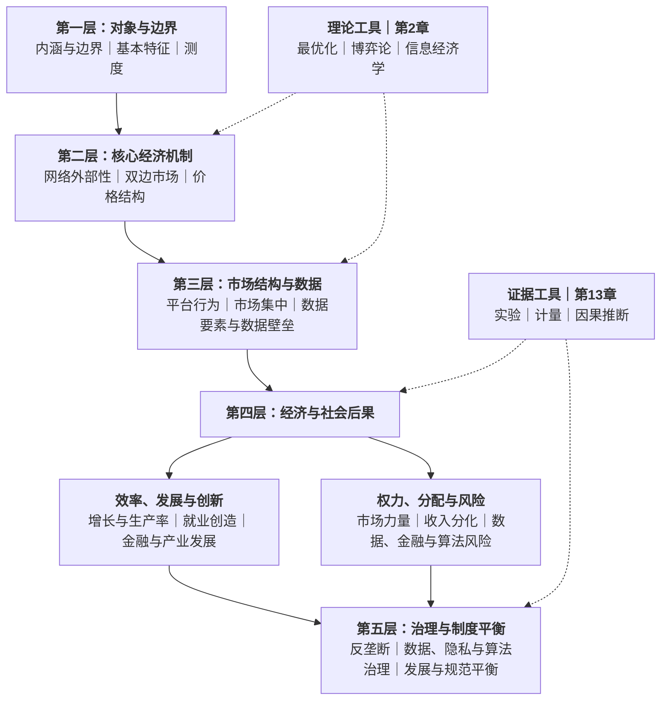

# 02｜数字经济的五层分析框架

数字经济的主要内容可以组织为五个层次：对象与边界、核心经济机制、市场结构与数据、经济与社会后果、治理与制度平衡。五层由研究对象出发，经过机制与结构，进一步延伸到结果与治理。

第2章的理论工具与第13章的证据工具贯穿其中。下面展示五层框架的完整结构。

---

## 一、五层框架：对象—机制—结构—结果—治理

五层框架按照“对象—机制—结构—结果—治理”组织教材知识：

五层依次回答五类不同的问题：对象与边界规定分析范围，核心经济机制解释现象产生的原因，市场结构与数据呈现机制在微观市场中的具体形态，经济与社会后果把分析扩展到增长、就业、金融和产业，第五层则进入制度回应与价值权衡。

层与层之间的箭头表示分析内容的衔接，不表示所有数字经济现象都沿同一条产业路径依次发生。数字金融、产业数字化和人工智能都有各自的具体机制；五层框架所统一的是分析层次，而不是把所有内容归结为平台演化。

五层框架使用的知识全部来自教材，其主要对应关系如下：

| 分析位置 | 主要教材内容 |
| --- | --- |
| 对象与边界 | 第1章的内涵、特征、概念辨析与测度；具体专题的对象界定 |
| 核心经济机制 | 第3—5章的网络外部性、双边市场、平台定价与商业模式 |
| 市场结构与数据 | 第6—7章的数字市场竞争、市场势力、数据要素与数据资产 |
| 效率、发展与创新 | 第6章的效率抗辩，以及第8—11章的增长、就业、金融和产业贸易效应 |
| 权力、分配与风险 | 第6章与第9—12章的竞争、分配、金融、隐私和算法风险 |
| 治理与制度平衡 | 第6章的反垄断，第7章的数据产权，以及第10、12章的金融、数据、隐私、平台责任和税收治理 |
| 贯穿工具 | 第2章的理论工具与第13章的计量和因果推断工具 |

---

## 二、第一层：对象与边界——内涵、特征与测度

第一层对应教材第1章，负责确定数字经济的研究对象、概念边界、基本特征和统计口径。后续关于网络外部性、平台竞争、数据要素、数字金融和产业转型的分析，都建立在这一层规定的范围之内。

这一层首先界定数字经济的内涵与构成。教材以数字知识和信息为关键生产要素、以数字技术为重要驱动力，并用数字产业化、产业数字化、数字化治理和数据价值化概括其主要组成。数字产业化指信息通信产业自身的发展，产业数字化指传统产业应用数字技术形成的产出增加和效率提升；数字化治理提供制度环境，数据价值化则使生产经营中形成的数据进一步成为可使用、可交易和可入表的资源。

其次，这一层处理相近概念的边界。信息经济强调信息部门和信息活动，互联网经济与网络经济强调网络连接及其经济活动，平台经济以双边或多边市场为典型组织形态，共享经济则是平台经济在闲置资源使用权交易中的具体形式。数字经济的范围最为综合，它将技术、网络、平台、数据和产业应用纳入统一对象。

再次，第1章用成本结构和报酬性质概括数字经济区别于传统经济的基础特征。数字产品通常具有较高的固定成本，而复制与分发的边际成本趋近于零；网络外部性带来需求侧报酬递增，数据的非竞争性带来供给侧报酬递增。摩尔定律、梅特卡夫定律和吉尔德定律分别从计算能力、网络价值和带宽成本刻画数字技术扩张的条件。

最后，测度把概念边界转化为可观察指标。教材区分增加值测度法与指数测度法：前者统计数字产业及数字化投入创造的经济产出，后者通过标准化和加权，将宏观经济、基础能力、基础产业和融合应用等多维信息合成为可比较的指数。定义、特征与测度共同构成第一层：既说明数字经济“包括什么”，也规定后续分析采用什么基本口径。

---

## 三、第二层：核心经济机制——网络、平台与价格结构

第二层是五层框架的微观理论核心，主要对应教材第3—5章。三章依次讨论网络外部性、双边市场和平台定价，形成“规模价值—平台组织—价格结构与变现”的连续机制。

第一组机制是网络外部性。第3章把网络外部性定义为：一种产品或服务对某个用户的价值，会受到使用同一产品或兼容产品的其他用户数量影响。直接网络外部性发生在同一类用户之间，间接网络外部性通过互补品或另一类用户传递。用户规模越大，产品价值越高；产品价值提高又吸引更多用户，需求侧规模因此形成正反馈。

正反馈并不意味着任何网络都必然增长。网络需要越过临界规模，才能从低采用均衡进入自我强化的高采用均衡。预期会影响用户是否加入，因而产生多重均衡和预期自我实现；先发优势、历史事件和兼容性选择又可能进一步形成路径依赖与用户锁定。临界规模、多重均衡、转换成本和兼容性共同解释了数字市场为什么可能快速扩张，也为什么后来者难以仅凭更低价格完成替代。

第二组机制是双边市场。第4章研究平台连接的不同用户群体：一侧用户的加入会改变另一侧用户获得的价值，这种关系称为交叉网络外部性。平台的经济功能，是把原本分散在两侧之间的外部性内部化，通过规则、匹配和价格结构协调双方参与。

双边市场的核心不是价格总水平，而是价格结构。即使两侧支付的总价格不变，重新分配两侧价格也可能改变参与规模和交易量，因此价格结构具有非中性。平台通常向价格敏感、且能为另一侧创造较大价值的一侧倾斜，表现为免费、补贴甚至负价格，再向另一侧收费。鸡生蛋问题、倾斜式定价、单归属与多归属、竞争瓶颈、排他和平台包抄，都是交叉网络外部性在平台组织与竞争中的具体表现。

第三组机制是定价与商业模式。第5章把第4章的价格结构进一步展开为数字企业的收入机制。零边际成本使传统的边际成本定价难以回收固定投入，网络效应又使扩大用户规模本身具有价值，因此数字企业普遍采用价格歧视、版本区分、免费与增值服务、注意力经济、广告竞价、佣金和抽成等方式变现。

数据使价格结构进一步精细化。企业可以利用用户特征和行为记录改善匹配，也可以进行个性化定价和行为价格歧视；免费用户的注意力可以被出售给广告主，交易平台则通过佣金在消费者、商家与平台之间重新分配交易收益。由此，第二层形成一条清晰的内部关系：网络外部性解释规模价值，双边市场解释平台如何组织这种价值，定价与商业模式解释平台如何在维持网络的同时实现收入。

网络外部性、零边际成本和数据非竞争性在教材中属于不同来源的机制：前者作用于需求侧价值，零边际成本描述数字产品的供给侧成本结构，数据非竞争性则来自数据要素的经济属性。它们可以共同强化数字企业的规模优势，但彼此之间并不存在“成本下降必然产生网络外部性”的单向关系。

---

## 四、第三层：市场结构与数据——规模、竞争与数据要素

第三层主要对应教材第6—7章。第二层解释网络、平台与定价的运行机制，第三层进一步呈现这些机制形成的市场结构，并把数字经济中的关键要素——数据——单独纳入分析。

第6章首先解释数字市场为什么容易集中。网络效应使领先者拥有更高的用户价值，规模经济和零边际成本使平均成本随规模扩大而下降，数据反馈又使更多用户和交易转化为更准确的推荐、匹配与风控。服务改善继续吸引用户并生成数据，正反馈由此不断增强。当几种力量叠加时，数字市场可能形成高度集中、赢家通吃或赢家通吃大部分的结构。

市场集中会改变企业竞争的方式。传统市场主要围绕价格和产量竞争，平台市场还会围绕用户归属、数据获取、接口控制和生态规则展开竞争。“二选一”通过限制商家多归属削弱竞争平台，自我优待利用平台对排序和入口的控制扶持自营业务，杀手型并购可能提前消除潜在竞争者，算法定价则可能缩短竞争者之间的反应时滞并提高合谋稳定性。这些行为将第二层的网络效应和价格结构进一步转化为市场力量。

市场集中、市场支配地位和滥用行为是三个不同层次。集中度描述市场结构，支配地位描述企业摆脱竞争约束的能力，滥用则指企业利用这种能力实施排除、限制竞争的行为。第6章以相关市场界定、HHI、勒纳指数和进入壁垒等工具测度市场结构与市场势力，同时强调：支配地位本身不违法，滥用才进入反垄断规制。

第7章从另一条线索进入数据要素。数据具有非竞争性，同一份数据可以被多个生产过程同时使用；数据又具有部分排他性，技术和制度能够限制他人访问。两种属性使数据既具有扩大共享、提高社会价值的效率潜力，也需要产权和激励制度维持采集、加工与治理投入。

教材以数据资源持有权、数据加工使用权和数据产品经营权的三权分置处理数据产权问题，随后讨论成本法、收益法、市场法等数据定价方法，以及数据资源满足条件后进入资产负债表的会计处理。数据由此完成从生产副产品到生产要素、数据产品和数据资产的转变。

数据在第三层具有双重作用。一方面，它是改善推荐、匹配、征信、风控和生产决策的投入，能够支持效率与创新；另一方面，数据反馈可能与网络效应结合，使领先企业持续改善服务，并抬高后来者的进入门槛。第三层的核心关系正是：平台机制塑造竞争结构，数据既参与价值创造，也可能转化为市场壁垒。

---

## 五、第四层：经济与社会后果——效率发展与权力风险

第四层把分析从企业与市场扩展到经济增长、就业分配、金融体系和产业贸易，主要对应教材第6章和第8—12章。同一组数字机制往往同时产生效率收益和权力风险，因此这一层分为两条相互联系的结果线。

### 1. 效率、发展与创新

第8章讨论数字经济的增长和生产率效应。数字资本、数据要素和数字基础设施可以进入生产函数，提高要素配置效率并促进知识扩散；但技术投入不会立即表现为生产率提升，组织调整、技能积累和互补资本尚未到位时，会出现“索洛悖论”。数字化的长期增长效应取决于技术扩散、制度环境和互补投资，而不只是设备或软件投入的数量。

第9章把技术影响落实到任务和劳动者。自动化会替代一部分由劳动完成的任务，也会提高另一些任务中劳动者的生产率，并创造新的任务、岗位和用工形式。就业总量和结构的变化取决于替代效应、生产率效应、新任务创造和需求扩张之间的共同作用。

第10章呈现数字技术在金融领域的效率价值。数字支付降低交易和服务成本，大数据征信利用替代数据缓解信息不对称，自动化风控降低小额金融服务的边际成本，长尾客户因此可能从“服务成本过高”转为“可以覆盖”。数字普惠金融的核心作用，是扩大传统金融难以触达群体的服务可得性。

第11章将效率分析扩展到企业、产业和贸易。数字技术改变企业内部协调成本与外部交易成本，进而影响企业边界；数字化转型通过软件、平台、工业互联网和数据决策改造传统产业；长尾经济与范围经济扩展产品种类和市场范围；数字贸易则使数字产品、数字交付服务和跨境数据流动成为新的国际交换形态。

### 2. 权力、分配与风险

效率提升并不自动保证收益平均分配。第6章说明，网络效应、规模经济和数据反馈可能在提高匹配效率的同时强化市场力量；当平台利用这种力量实施排他、自我优待或算法合谋时，效率优势会进一步转化为竞争损害。

第9章讨论技术进步的分配后果。自动化对不同任务和技能群体的影响不对称，可能扩大技能溢价和就业极化；超级明星企业和平台抽成会改变资本与劳动之间的收入分配；零工用工提高灵活性的同时，也可能把需求波动和保障成本转移给劳动者。数字鸿沟则从接入、使用进一步延伸到结果差异。

第10章揭示数字金融的风险边界。P2P和平台金融可能使金融功能脱离资本约束、存款保险和审慎监管，期限错配、流动性风险与风险外溢随之上升；数字货币和即时转账提高支付效率，也可能加快存款迁移与数字挤兑。

第12章集中讨论数据、隐私与算法风险。数据收集存在信息不对称、隐私外部性和不可逆性，知情同意又可能受到同意疲劳与行为偏差影响；算法推荐和自动化决策可能带来不透明、歧视和责任归属问题；跨境数据流动同时涉及经济效率、个人信息保护与国家数据安全。

两条结果线共同说明第四层的基本关系：数字化能够扩大总量和提高效率，但总量收益、分配结果和风险承担并不一致；短期替代也不等于长期净效应；市场集中既可能来自效率，也可能被排他行为进一步固化。经济与社会后果必须放在这些条件和层次中理解。

---

## 六、第五层：治理与制度平衡——竞争、数据与风险治理

第五层是对前四层机制、结构和后果的制度回应，核心内容集中在第6、7、10和12章。数字经济治理并不是单一的“平台监管”，而是由竞争制度、数据产权、隐私与安全、算法责任、金融监管和国际税收共同构成。

第一部分是平台反垄断。第6章形成了一套五步分析结构：相关市场界定确定竞争约束的范围，市场支配地位认定判断企业是否具有摆脱竞争约束的能力，滥用行为认定识别排他、自我优待、差别待遇等行为，竞争损害论证判断行为是否排除或限制竞争，效率抗辩则考察行为是否带来不可替代的效率收益。五步结构将市场规模、市场力量和违法行为区分开来，体现了“支配地位本身不违法，滥用才违法”的基本边界。

第二部分是数据产权、隐私与数据安全。第7章的三权分置淡化对数据完整所有权的争论，把数据资源持有、加工使用和数据产品经营分配到不同权利层级，以协调数据流通、生产激励与权益保护。第12章进一步建立数据治理的制度框架，通过分类分级、知情同意、最小必要、敏感个人信息保护和数据出境规则，约束数据收集、处理、使用和跨境流动。

第三部分是平台责任与算法治理。平台既提供交易和信息基础设施，也制定准入、排序和分配规则，其角色已经不只是被动通道。平台责任制度围绕审核义务、安全保障、违法内容处理和生态治理展开；算法治理则进入推荐、排序、自动化决策和生成式人工智能，关注透明度、差别待遇、用户选择、备案与可问责性。算法合谋还同时连接第6章的竞争规则，表明同一种技术可能跨越数据、消费者保护和反垄断多个制度领域。

第四部分是金融、就业与分配制度。第10章以“金融业务必须持牌”为基本边界，把平台金融重新纳入资本约束、风险隔离和审慎监管；数字人民币通过M0定位、双层运营、限额和不计息等设计，在支付效率、货币政策与金融稳定之间进行协调。第9章涉及的就业替代、零工保障和数字鸿沟，则需要职业培训、社会保障和公共数字基础设施等制度共同回应。

第五部分是数字税与跨境协调。传统常设机构原则依赖企业的物理存在，难以覆盖数字企业在市场国创造的用户和数据价值。数字服务税、OECD双支柱方案与全球最低税试图重新分配征税权，同时处理税负转嫁、重复征税和国际协调问题。跨境数据规则则在数据流通收益、个人信息保护和国家安全之间划定边界。

这些制度共同指向四组长期存在的平衡：发展与规范、创新与竞争、效率与公平、开放与安全。治理不是五层框架之外的附加内容，而是对前面所识别的市场失灵、分配后果和风险外溢作出的制度安排。

---

## 七、两套贯穿全程的工具：理论解释与证据检验

五层框架的两侧还有两套贯穿工具。它们不单独构成一个分析层次，而是分别为机制解释和经验检验提供方法基础。

### 1. 理论工具：解释“为什么”

第2章提供最优化、博弈论、信息经济学和概率统计基础。它们不是与数字经济内容并列的一个专题，而是后续机制分析的共同语言。

最优化分析企业和用户在约束条件下的选择，是平台定价、数据投入和隐私权衡的基础；博弈论分析平台之间、平台与用户之间的策略互动，支撑双边市场竞争、排他行为和算法合谋；信息经济学处理逆向选择、道德风险、信号、委托代理和拍卖，连接数字金融、平台评价与广告竞价；概率统计则为风险、不确定性和数据推断提供基本语言。

理论工具把概念之间的关系转化为效用、利润、均衡和福利条件，使网络外部性、平台定价、数据交易和治理权衡能够被清晰推导。

### 2. 证据工具：检验“是否成立”

第13章把理论命题转化为可以用数据检验的经验问题。OLS建立变量关系的基准表达，内生性分析说明相关关系为什么不能直接解释为因果关系；双重差分利用政策的时空变化，工具变量利用外生冲击，断点回归利用阈值分配，匹配与合成控制则构造更可比的反事实。

平台A/B实验通过随机分组比较补贴、推荐和产品功能的效果，但网络外部性可能使实验组行为影响对照组，短期指标也可能偏离长期价值。随机化能够提高内部效度，却不自动保证结论适用于其他人群、地区和时期。

理论与证据承担不同作用：理论工具说明一种结论为什么可能成立，证据工具检验它在现实中是否成立、成立到什么程度，以及结论能够推广到什么范围。

---

## 八、五层之间的整体关系

五个层次不是五组并列目录。第一层规定研究对象和统计边界，是后续分析的起点；第二层提供网络外部性、双边市场和价格结构等核心机制；第三层说明这些机制如何形成平台行为、市场集中与数据要素配置；第四层把影响扩展到增长、就业、金融、产业、分配与风险；第五层则以竞争、数据、隐私、算法、金融和税收制度回应前述结果。

理论工具与证据工具贯穿五层：第2章把机制写成主体选择、策略互动与均衡条件，第13章把理论命题转化为可以识别和检验的因果问题。两套工具分别支撑“为什么成立”和“现实中是否成立”。

由此，整本数字经济可以收束为一条稳定的分析主线：

> **对象与边界 → 核心经济机制 → 市场结构与数据 → 经济与社会后果 → 治理与制度平衡。**

下面将通过一道真题，展示这五个层次怎样在一个具体问题中连接起来。
