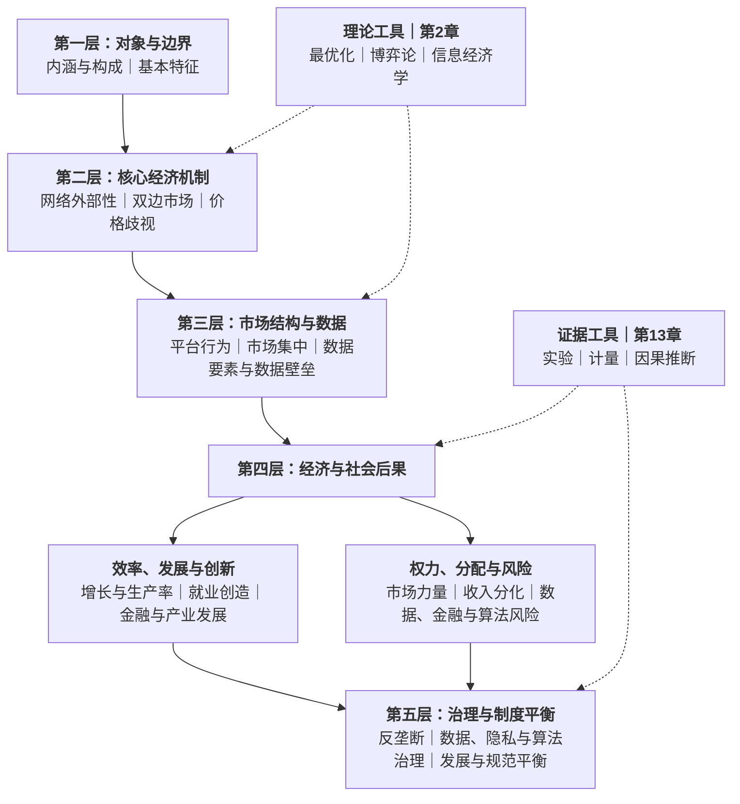
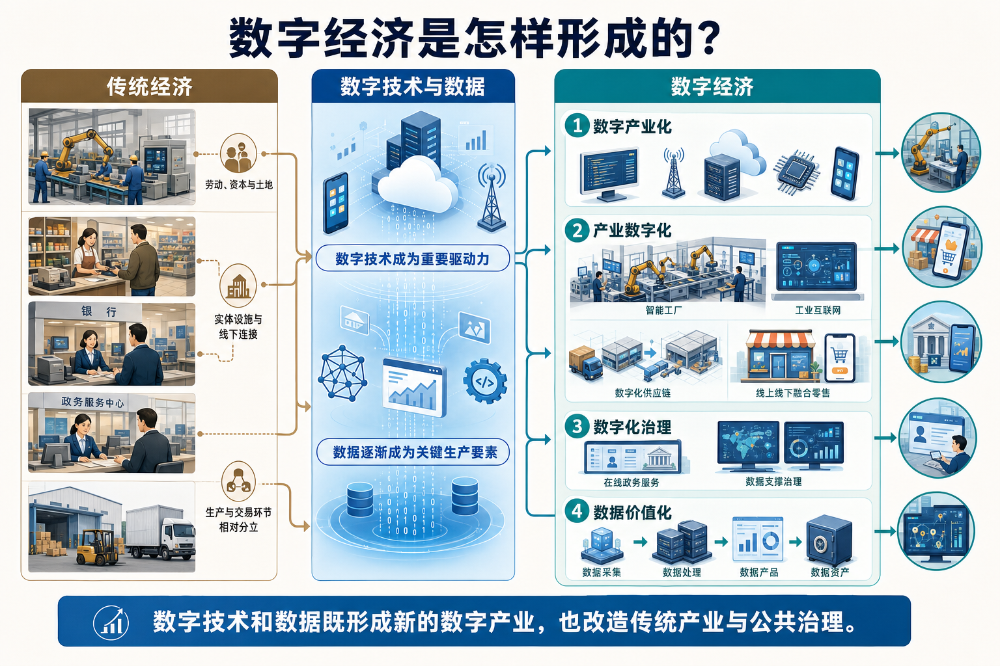
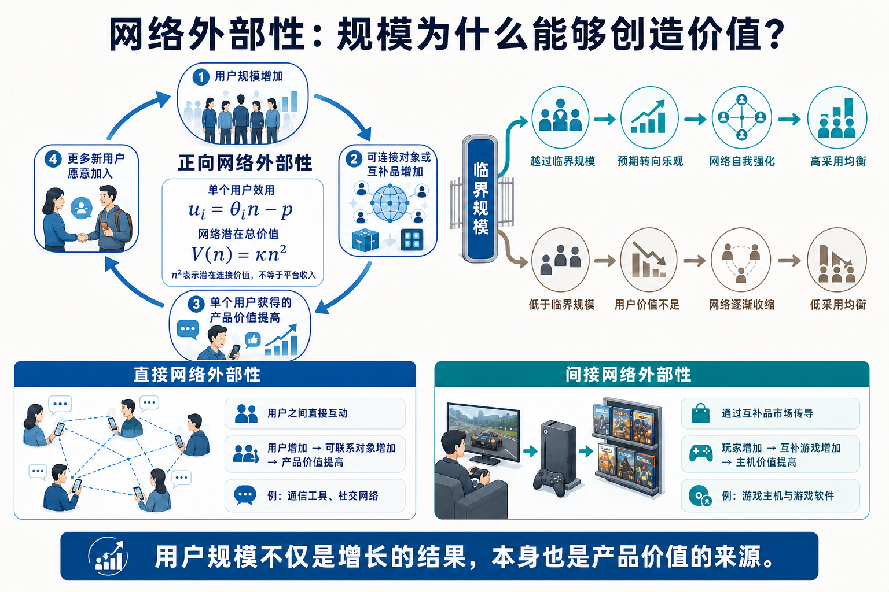
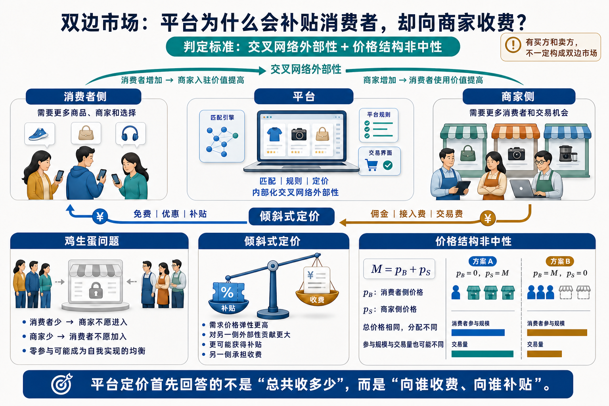
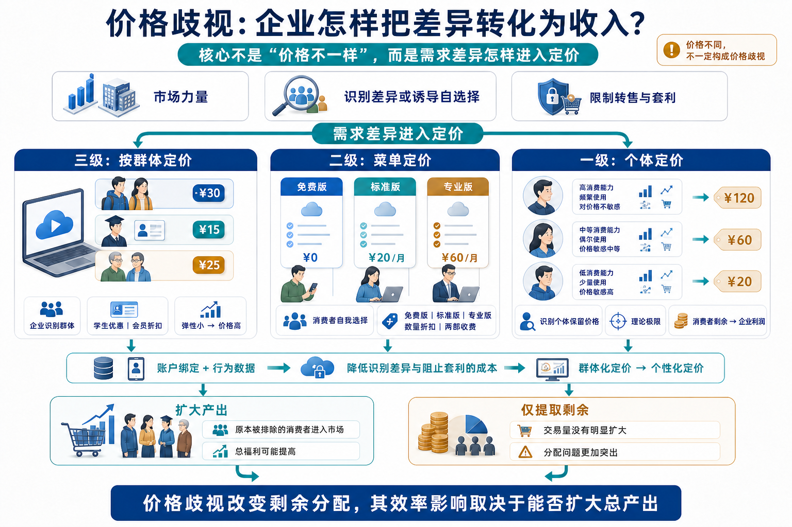
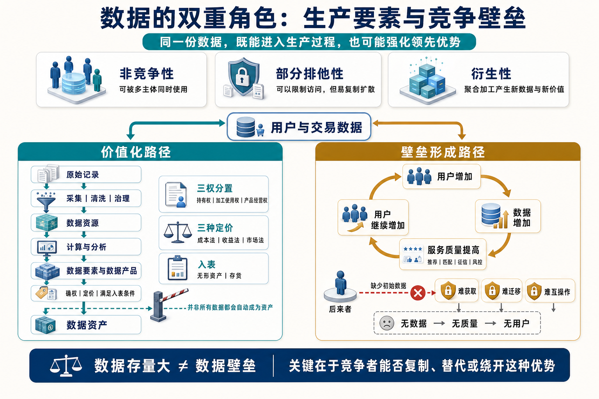

# 02｜数字经济的五层分析框架

数字经济的主要内容可以组织为五个层次：对象与边界、核心经济机制、市场结构与数据、经济与社会后果、治理与制度平衡。五层由研究对象出发，经过机制与结构，进一步延伸到结果与治理。

第2章的理论工具与第13章的证据工具贯穿其中。下面展示五层框架的完整结构。

---

## 一、五层框架：对象—机制—结构—结果—治理

五层框架按照“对象—机制—结构—结果—治理”组织教材知识：

五层依次回答五类不同的问题：对象与边界规定分析范围，核心经济机制解释现象产生的原因，市场结构与数据呈现机制在微观市场中的具体形态，经济与社会后果把分析扩展到增长、就业、金融和产业，第五层则进入制度回应与价值权衡。

层与层之间的箭头表示分析内容的衔接，不表示所有数字经济现象都沿同一条产业路径依次发生。数字金融、产业数字化和人工智能都有各自的具体机制；五层框架所统一的是分析层次，而不是把所有内容归结为平台演化。

五层框架使用的知识全部来自教材，其主要对应关系如下：

| 分析位置 | 主要教材内容 |
| --- | --- |
| 对象与边界 | 第1章的内涵、构成与基本特征；具体专题的对象界定 |
| 核心经济机制 | 第3—5章的网络外部性、双边市场与价格歧视 |
| 市场结构与数据 | 第6—7章的数字市场竞争、市场势力、数据要素与数据资产 |
| 效率、发展与创新 | 第6章的效率抗辩，以及第8—11章的增长、就业、金融和产业贸易效应 |
| 权力、分配与风险 | 第6章与第9—12章的竞争、分配、金融、隐私和算法风险 |
| 治理与制度平衡 | 第6章的反垄断，第7章的数据产权，以及第10、12章的金融、数据、隐私、平台责任和税收治理 |
| 贯穿工具 | 第2章的理论工具与第13章的计量和因果推断工具 |

---

## 二、第一层：对象与边界——什么才算数字经济

一家软件企业属于数字经济，这一点没有太大争议。但一家制造企业把生产线接入工业互联网，一家商店通过平台销售商品，一家银行利用数据开展征信，一个政府部门用数据辅助公共治理，它们算不算数字经济？

回答这些问题，不能只看某项活动是否“搬到了线上”，也不能把数字经济简单等同于互联网企业。数字经济并不是传统经济之外新增的一小块产业：它既包括数字技术催生的新产业，也包括数字技术和数据要素对传统生产、交易与治理活动的改造。

### 1. 从传统经济到数字经济，什么发生了变化？

传统经济主要围绕劳动、资本、土地等要素组织生产，生产、流通、消费和治理大多依赖实体设施与线下连接。数字经济并没有取消这些活动，而是在原有经济体系中加入新的生产要素和技术条件，使经济活动的范围与组织方式发生变化。

*图2-1｜从传统经济到数字经济*

数字技术和数据进入经济活动后，一方面催生了软件、通信、云计算等新的数字产业；另一方面进入制造、商业、金融和公共治理，改变原有的生产与治理方式。

教材将这些变化概括为数字产业化、产业数字化、数字化治理和数据价值化。数字产业化对应新产业的形成，产业数字化对应传统产业的改造，数字化治理将数字技术用于公共治理和市场治理，数据价值化则使生产经营中形成的数据经过采集、加工和权利配置，成为可以开发利用的资源。四者共同构成数字经济的基本范围。

### 2. 为什么数字市场会呈现不同规律？

数字产品与传统产品之间的重要差别，主要体现在成本结构和报酬性质上。

**第一，复制与分发的边际成本趋近于零。**软件、数据和数字内容通常需要较高的前期投入，但产品一旦形成，新增一次复制或分发的成本很低。如果仍然按照边际成本定价，企业便难以收回前期投入，因此需要借助订阅、广告补贴、版本区分等方式实现收入。零边际成本由此改变了传统市场的定价逻辑。

**第二，边际收益递增。**这种递增来自两个方向：在需求侧，网络外部性使用户越多，产品对每个用户的价值越高；在供给侧，数据具有非竞争性，同一份数据可以同时进入多个生产过程。两种力量叠加，使数字市场形成“越大越强”的正反馈，并可能推动市场走向集中。

零边际成本改变企业的定价与变现方式，边际收益递增则放大网络规模与数据积累的价值。接下来，需要进一步解释这些变化通过什么经济机制发挥作用。

> **完整版内容**：这里保留的是第一层最核心的主线。完整版第1章还包括数字经济定义的演进与G20标准口径、数字产业化和产业数字化的统计边界、三大定律及模型推导、相关概念谱系、发展历程与全球格局，以及增加值法和指数法等测度方法。

---

## 三、第二层：核心经济机制——理解数字市场的三组工具

为什么一个产品的用户越多，它反而越有价值？为什么平台可以长期补贴消费者，却向商家收取佣金？为什么同一种数字服务，会向不同消费者收取不同价格？

这三个看似反常的现象，分别对应教材第3—5章反复使用的三组核心工具：

| 需要解释的问题 | 核心工具 | 工具在分析中的作用 |
| --- | --- | --- |
| 为什么规模本身能够创造价值 | 网络外部性 | 解释用户规模怎样进入产品价值，并形成正反馈 |
| 为什么平台会补贴消费者，却向商家收费 | 双边市场 | 解释交叉网络外部性、价格结构与平台补贴 |
| 企业怎样把用户差异和信息转化为收入 | 价格歧视 | 解释差异化定价、价值变现及其福利后果 |

### 1. 网络外部性：规模为什么能够创造价值

传统商品的价值主要取决于商品自身的质量和价格，网络产品的价值还会受到用户规模影响。教材将网络外部性定义为：一种产品或服务对某个用户的价值，会随着使用同一产品或兼容产品的其他用户数量变化而变化。在第3章的基本模型中，这种关系被写入用户效用：

$$
u(\theta)=\theta n-p
$$

其中，$n$ 表示预期或实际用户规模，$\theta$ 表示用户对网络价值的重视程度，$p$ 表示接入价格。用户规模不再只是企业增长的结果，而是直接进入用户效用，成为产品价值的一部分。

网络外部性不仅意味着单个用户获得的价值会随用户规模增加，也意味着整个网络的潜在价值会随用户数量扩大。梅特卡夫定律将这种关系表示为：

$$
V(n)=\kappa n^2
$$

其中，$n$ 表示用户数量，$\kappa$ 表示每条潜在连接的平均价值。用户数量增加一倍，整个网络的潜在价值大约增加到原来的四倍。这说明，网络规模的扩大不只是增加了用户数量，还会更快地放大整个网络可能创造的价值。需要注意的是，这里描述的是潜在网络价值，并不等于平台已经实现的收入或利润。

> **完整版推导**：梅特卡夫定律的潜在连接数计算、平方关系及其修正形式，详见完整版第1章。

*图2-2｜网络外部性：规模为什么能够创造价值*

正反馈并不意味着网络一定会自动增长。规模低于临界点时，用户获得的价值不足，网络可能继续收缩；越过临界点以后，用户规模与产品价值相互强化，网络才可能进入高采用均衡。因此，平台早期的补贴、预发布和兼容策略，都是为了影响用户预期并推动网络越过这一门槛。

> **网络外部性解释的是：为什么用户规模不仅是增长的结果，本身也是价值的来源。**

### 2. 双边市场：平台为什么会补贴消费者，却向商家收费？

持卡人购买商品时仍然需要支付商品价款，但通常不需要为刷卡本身向银行卡网络付费，还可能获得积分或返现；商家每完成一笔银行卡交易，却要支付刷卡手续费。同一个支付平台为什么会让消费者一侧免费甚至获得补贴，却向商家一侧收费？

这里需要先区分两种价格。消费者支付给商家的是商品或服务的价款，平台定价讨论的则是平台向两侧收取的接入费、交易费和佣金，以及平台向某一侧提供的补贴。消费者购买商品花了钱，并不意味着平台也向消费者收了费。

在传统的单边市场中，企业生产或采购商品，再将商品出售给消费者。企业主要面对一类需求者，通常只需要决定一个价格。平台则不同：它提供连接、规则和交易基础设施，让两类用户在平台上互动。一侧用户增加会提高另一侧参与平台的价值，这种跨越平台两侧的影响称为**交叉网络外部性**。

两侧价值相互依赖，首先带来的是启动困难。消费者会因为商家太少而不愿加入，商家又会因为消费者太少而不愿进入，由此形成鸡生蛋问题。平台要打破这种相互等待，就需要先降低一侧的进入成本，用这一侧的参与带动另一侧，再从另一侧获得收入。

平台定价由此不再只是“总共收多少”，还要决定“向谁收费、补贴谁”。平台向两侧收取的费用之和称为**价格总水平**，这笔费用在两侧之间如何分配称为**价格结构**。例如，每笔交易合计收费10元，全部由商家承担，与全部由消费者承担，价格总水平相同，价格结构却完全不同。如果总收费不变，仅仅改变两侧的价格分配，就会改变参与规模和交易量，教材将这种现象称为**价格结构非中性**。这也是双边市场的判定标准。

*图2-3｜双边市场：平台为什么会补贴消费者，却向商家收费？*

一侧免费或获得补贴、另一侧承担收费，就是双边市场常见的**倾斜式定价**。具体补贴哪一侧，并不由“买方”或“卖方”的身份决定，而取决于两侧的价格弹性，以及一侧用户增加能够为另一侧创造多少价值。

平台完成冷启动以后，问题又从“怎样协调两侧”转向“用户怎样选择平台”。用户只加入一个平台，称为**单归属**；同时加入多个平台，称为**多归属**。用户是否多归属，取决于第二个平台带来的增量价值能否覆盖额外的接入和使用成本。

当一侧用户单归属、另一侧用户多归属时，就可能形成**竞争瓶颈**。平台会争夺单归属用户；一旦获得这些用户，每个平台都掌握了通向自己用户的独占入口。多归属一侧为了覆盖全部单归属用户，只能分别接入每一个平台。经典的报纸市场中，读者通常只读一份报纸，广告主却需要在多份报纸上投放，报纸因而可以低价吸引读者，再向广告主收费。归属结构由此进一步影响平台究竟补贴哪一侧、向哪一侧收费。

这里还需要区分两种看似相近的收费方式。双边市场的价格结构讨论平台如何在**不同侧之间**分配价格；下一节的价格歧视则讨论企业如何在**同一侧内部**针对不同消费者设计价格。

> **完整版推导**：价格结构公式、补贴条件、多归属决策与竞争瓶颈模型，详见完整版第4章。

> **双边市场解释的是：平台为什么会补贴消费者、向商家收费，以及这种价格结构如何协调两侧参与。**

### 3. 价格歧视：企业怎样把价值转化为收入

价格歧视是指同一厂商对同一产品向不同消费者收取不同价格。它不是简单的“价格不一样”，而是一套围绕需求差异展开的定价工具，主要回答三个问题：什么条件下差异化定价可行，企业怎样设计不同价格，以及这种定价会产生怎样的效率和分配后果。

价格歧视通常需要三个条件：企业具有一定市场力量，能够识别消费者差异或设计让消费者自我选择的机制，并且能够限制不同消费者之间的转售和套利。数字服务绑定个人账户，平台又可以积累用户身份与行为数据，这使需求识别和阻止转售的成本明显下降，价格歧视因而从经典理论变成数字市场中的普遍实践。

教材按照信息条件将价格歧视分为三级：

| 类型 | 企业掌握的信息与定价方式 | 数字市场中的典型表现 |
| --- | --- | --- |
| 三级价格歧视 | 识别不同消费者群体，并按群体定价 | 学生优惠、会员身份折扣、面向不同商户的分层费率 |
| 二级价格歧视 | 无法直接识别类型，通过数量、版本或套餐让消费者自我选择 | 数量折扣、版本区分、两部收费、Freemium |
| 一级价格歧视 | 掌握个体保留价格，对每个消费者分别定价 | 完全个性化定价的理论极限 |

三级价格歧视的基本规则是向需求弹性较小的群体收取更高价格；二级价格歧视则依靠自选择菜单让消费者主动暴露类型；一级价格歧视能够提取全部消费者剩余，是现实中的极端基准。数字平台利用浏览、搜索、购买和设备等行为数据推断支付意愿，形成行为价格歧视，其精细程度介于三级与一级之间，“大数据杀熟”是其中最受争议的表现。

价格歧视会改变剩余在企业与消费者之间、以及不同消费者群体之间的分配，但其总福利影响不能只看价格差异。教材给出的基本判断是：如果差异化定价使原本被统一高价排除的消费者进入市场，总产出扩大，总福利可能提高；如果只是对既有交易进行更精细的剩余提取，分配问题就会更加突出。因此，价格不同不一定构成“杀熟”，价格歧视本身也不当然违法，关键要区分定价依据、市场力量、产出变化和分配后果。

*图2-4｜价格歧视：企业怎样把差异转化为收入*

第5章进一步把价格歧视作为共同的理论底座，展开到数字企业的变现工具。会员费加低单价体现两部收费，免费版与收费版的功能切割体现二级价格歧视，行为数据支持个性化定价；免费用户的注意力可以出售给广告主，平台还可以向商家收取佣金或交易费。注意力广告和佣金并不等同于价格歧视，但它们与差异化定价共同回答一个经营问题：平台怎样把已经形成的用户价值转化为收入。

> **价格歧视解释的是：企业怎样识别需求差异、设计价格，并重新分配交易产生的剩余。**

### 4. 三组工具怎样共同工作

三组工具分别承担不同作用：

| 核心工具 | 在框架中的位置 | 最直接的判断对象 |
| --- | --- | --- |
| 网络外部性 | 价值创造 | 用户规模是否影响产品价值 |
| 双边市场 | 价值组织 | 不同用户群体之间是否存在交叉外部性，价格结构是否非中性 |
| 价格歧视 | 价值实现与分配 | 企业是否利用需求差异和信息条件实施差异化定价 |

三者并不是任何数字经济问题都必须依次经过的单向链条。单边网络产品也可能存在网络外部性，非平台企业同样可以实施价格歧视。但在典型平台问题中，三组工具经常叠加：网络外部性使用户规模产生价值，双边市场通过价格与规则协调不同用户群体，价格歧视则进一步把用户差异转化为收入。由此可以形成一条便于理解的关系：

> **网络外部性创造规模价值 → 双边市场组织交叉价值 → 价格歧视实现价值并改变剩余分配。**

网络外部性、零边际成本和数据非竞争性在教材中仍然属于不同来源的机制：网络外部性作用于需求侧价值，零边际成本描述数字产品的供给侧成本结构，数据非竞争性来自数据要素的经济属性。它们可能共同强化数字企业的规模优势，但彼此之间不存在“成本下降必然产生网络外部性”的单向关系。

---

## 四、第三层：市场结构与数据——数字市场为什么容易走向集中？

为什么有些数字市场不是随着企业增加而长期保持分散，反而逐渐由少数平台占据主要用户、交易和数据？要回答这个问题，不能只看平台当前“有多大”，而要继续追问：领先优势为什么会自我强化，市场集中是否等于垄断，以及数据在其中究竟扮演什么角色。

第三层因此依次回答三个问题：

> **领先平台为什么会越来越强？市场集中就等于垄断吗？数据为什么既能创造价值，也会形成壁垒？**

### 1. 领先平台为什么会越来越强？

教材将数字市场集中概括为三重力量的叠加：**网络效应、规模经济与数据反馈**。三种力量分别从产品价值、成本结构和服务质量三个方向强化领先者。

网络效应作用于需求侧。用户规模越大，产品对每个用户的价值越高，领先平台因而更容易继续吸引用户。规模经济作用于供给侧。数字产品通常需要承担研发、服务器、内容和系统建设等固定成本，复制与分发的边际成本却很低；用户规模扩大以后，固定成本被更多用户分摊，平均成本继续下降。两种机制叠加后，大平台可能同时拥有更高的用户价值和更低的单位成本。

数据反馈进一步把规模优势转化为质量优势。用户使用平台产生搜索、点击、交易和评价数据，平台利用数据改善推荐、匹配、征信与风控，服务质量提高后又吸引并留住更多用户。教材把这一过程概括为：

> **用户规模增加 → 数据存量增加 → 服务质量提高 → 用户规模继续增加**

在第6章的数据反馈模型中，平台的数据存量满足 $d_{t+1}=f(d_t)$。其中，$f'(d)>0$ 表示数据越多，下一期能够产生的数据越多；$f''(d)<0$ 表示数据改善服务的边际贡献会递减。数据优势并不是无限增长的，但在排他性较强、进入者缺少初始数据的情况下，后来者会陷入“无数据则无质量、无质量则无用户、无用户则无数据”的进入死结。

因此，数字市场走向集中并不是由某一个因素单独决定的。只有当网络效应、规模经济和数据反馈相互强化，并且用户迁移、数据获取或兼容接入存在障碍时，领先优势才可能不断累积，最终形成赢家通吃或赢家通吃大部分的市场结构。

### 2. 市场集中就等于垄断吗？

市场集中只是分析的起点，不能直接推出企业具有支配地位，更不能直接推出企业实施了滥用行为。第三层必须区分三个层次：

| 分析层次 | 要回答的问题 | 教材中的判断重点 |
| --- | --- | --- |
| 市场集中 | 市场份额是否集中在少数企业手中 | 企业数量、份额分布与HHI |
| 市场支配地位 | 企业能否在较大程度上摆脱竞争约束 | 相关市场、定价权、进入壁垒与潜在竞争 |
| 滥用行为 | 企业是否利用市场力量排除或限制竞争 | 二选一、自我优待、杀手型并购、算法合谋、搭售与预装 |

第一步是确定竞争发生在哪里。相关市场界定以产品之间的替代性为核心，SSNIP测试考察假想垄断者小幅、显著且非暂时性涨价是否仍然有利可图；面对消费者侧价格为零的平台，还需要观察质量下降、注意力和数据等非价格维度。市场边界划得过窄会夸大市场势力，划得过宽则会掩盖竞争约束。

第二步是判断企业拥有多大市场势力。HHI从企业份额分布衡量市场集中度，勒纳指数 $L=(P-MC)/P$ 从价格高于边际成本的程度衡量定价权，进入壁垒则考察后来者能否获得用户、数据、接口和必要的互补资源。数字产品边际成本接近于零、多边平台采用倾斜式定价，都会使单一指标产生误导，因此这些工具必须结合使用。

第三步才是识别平台行为。平台成为用户与商家之间难以绕开的通道后，可能取得对排序、入口、接口和生态规则的控制力。“二选一”限制商家多归属，自我优待利用平台规则扶持自营业务，杀手型并购提前消除潜在竞争者，算法合谋则可能提高协调价格的稳定性。这些行为是否构成竞争损害，需要在市场边界、市场势力、行为效果和效率理由之间继续判断。

因此，这一问最终留下的边界是：

> **市场集中不等于市场支配地位，市场支配地位也不等于滥用。**

### 3. 数据为什么既能创造价值，也会形成壁垒？

数据并不是附着在平台竞争之外的另一个话题。网络效应和规模经济解释用户与成本优势，数据则同时进入企业生产过程和竞争过程，是连接第6章市场结构与第7章数据要素的关键。

数据首先是一种生产要素。它具有**非竞争性**，同一份数据可以被多个生产过程同时使用；具有**部分排他性**，企业可以通过技术、合同和制度限制他人访问；还具有**衍生性**，生产、交易和使用活动会不断产生新的数据。原始记录只有经过采集、清洗、治理和分析并实际参与生产，才从数据资源转化为数据要素，用于改善推荐、匹配、征信、风控和生产决策。

数据要进入市场，还要继续回答三个问题：谁可以使用、价值怎样确定、能否确认为资产。教材以**数据资源持有权、数据加工使用权和数据产品经营权**的三权分置配置数据权利；以成本法、收益法和市场法处理数据定价；当数据资源满足企业拥有或控制、预期带来经济利益且成本能够可靠计量等条件时，才可能作为无形资产或存货进入资产负债表。由此形成一条价值化路径：

> **原始记录 → 数据资源 → 数据要素与数据产品 → 数据资产**

但同样的数据也可能进入另一条路径。领先平台拥有更多用户和交易数据，能够更快改善算法与服务；如果这些数据不能被其他企业获得、迁移或互操作，数据反馈就会提高后来者的进入成本。此时，数据不只是一项提高效率的生产投入，也会与网络效应、用户锁定和平台规则结合，形成数据壁垒。

*图2-5｜数据的双重角色：生产要素与竞争壁垒*

判断数据是否构成壁垒，不能只看企业存储了多少数据，还要看数据是否具有排他性、能否被替代、是否能够有效转化为服务质量，以及进入者能否获得维持竞争所需的数据。数据存量大可能来自效率竞争，数据壁垒则强调这种优势是否难以被竞争者复制或绕开。

第三层最终形成的分析路径是：

> **网络效应、规模经济与数据反馈 → 优势持续积累 → 市场集中 → 市场力量与平台行为。**
>
> **数据既参与价值创造，也可能把领先优势固化为进入壁垒。**

---

## 五、第四层：经济与社会后果——数字化创造了什么，又带来了什么代价？

数字化可以提高生产率、扩大市场和改善服务，也可能替代部分任务、改变收入分配并放大新的风险。面对这些看似相反的结论，不能简单回答“数字化是好还是坏”，而要把经济与社会后果拆成三个依次递进的问题：

> **总量是否增加？收益如何分配？风险由谁承担？**

这三个问题分别对应总量效应、分配效应和风险效应。只有把三者分开，才能解释为什么同一种数字技术可能同时带来增长、就业冲击、普惠服务和风险外溢。

### 1. 数字化真的会提高增长与效率吗？

判断数字化的总量效应，首先要区分“投入增加”和“效率提高”。企业购买更多计算机、软件和数字设备，属于数字资本投入增加；数据参与生产、组织流程改善、资源配置效率提高，则可能表现为全要素生产率上升。教材将数据纳入生产函数 $Y=AF(K,L,D)$，说明数字资本、劳动和数据都可以直接贡献产出，但长期增长不能只靠要素数量扩张，还取决于技术进步、知识扩散和数字基础设施的外部性。

技术投入也不会立即转化为生产率。索洛悖论所描述的，正是数字技术投资迅速增加而生产率统计表现平淡的现象。教材给出三种解释：**测度问题**使质量改善、免费数字产品和无形资本的价值被统计遗漏；**时滞效应**意味着组织流程、员工技能和商业模式等互补资本尚未完成调整；**分配效应**则使技术收益集中于少数超级明星企业，平均生产率和国民账户无法充分呈现。因此，短期“看不见生产率”既不等于技术无效，也不保证红利最终一定兑现。

总量效应还会通过金融、产业和贸易扩展。数字支付降低交易成本，大数据征信和自动化风控缓解信息不对称，使原本服务成本过高的长尾客户获得金融服务；软件、平台和工业互联网改变企业内部协调成本与外部交易成本，推动传统产业数字化；数字分发的低边际成本、长尾经济与范围经济扩大产品种类和市场范围，数字产品、数字交付服务和跨境数据流动则形成新的贸易形态。

这些变化共同说明，数字化的总量收益不是“装上技术”就会自动出现，而要经过一条更完整的传导链：

> **数字投入 → 组织与技能等互补资本 → 技术扩散与应用 → 生产率、服务可得性和市场范围提高。**

### 2. 技术进步会让谁受益，又会替代谁？

总量增长并不意味着每一个劳动者、企业和地区都会同步受益。分析就业时，首先不能把“某些任务被替代”直接写成“就业总量下降”。自动化会使机器完成原本由劳动承担的任务，形成替代效应；技术进步也会降低成本、扩大需求、提高劳动者在其他任务中的生产率，并创造新的产品、任务和岗位，形成创造效应。就业的净变化取决于两种力量的相对强弱。

任务模型进一步把问题从“一个职业会不会消失”改写为“这个职业包含哪些任务”。能够被标准化、编码化的任务更容易自动化，需要判断、沟通、创造和复杂环境适应的任务更可能与技术互补。人工智能既可能替代部分认知任务，也可能提高其他知识劳动者的生产率，因此真正需要判断的是自动化边界怎样变化，而不是把职业简单分成“会消失”和“不会消失”。

即使就业总量没有下降，结构和收入分配仍可能发生显著变化。技能偏向型技术进步提高高技能劳动的相对需求，就业极化使中等技能、常规任务岗位受到更大冲击；数字分发和推荐算法把微小的质量差异放大为巨大的市场规模差异，形成超级明星效应。平台市场势力和数据租金还可能提高资本所得、压低劳动收入份额，平台抽成与算法派单则改变零工劳动者的净收入、工作强度与风险承担。

分配问题还包括谁根本没有进入数字红利的分配过程。数字鸿沟依次表现为**接入沟、使用沟和结果沟**：能否接入网络和设备，只是第一层；能否有效使用数字技术、能否把使用转化为收入、教育和生活机会，决定了更深层的差距。接入率提高不等于数字鸿沟消失，技术越深入，差距越可能从“能不能用”转向“能不能真正受益”。

因此，就业与分配问题不能只问“新增了多少岗位”，而要继续追问：

> **哪些任务被替代，哪些劳动者得到互补，新增收益流向谁，调整成本又由谁承担？**

### 3. 为什么效率提升会伴随新的风险？

数字经济中的风险往往不是效率之外偶然出现的副作用，而是同一机制的另一面。能够降低成本、扩大规模和提高匹配精度的技术，也可能增强市场力量、提高系统关联度或扩大信息不对称。

| 数字机制 | 创造的价值 | 可能伴随的风险 |
| --- | --- | --- |
| 网络效应、规模经济与数据反馈 | 降低平均成本，提高推荐、匹配和服务质量 | 市场集中、进入壁垒与平台控制力增强 |
| 数字金融、数据征信与即时支付 | 降低金融服务成本，扩大普惠金融覆盖 | 期限错配、流动性风险、风险外溢与数字挤兑 |
| 数据收集与算法决策 | 提高识别、预测和自动化决策能力 | 隐私外部性、不透明、歧视与责任归属困难 |
| 数字连接与跨境数据流动 | 扩大产业协作、市场范围和数字贸易 | 产业链依赖、个人信息保护与数据安全风险 |

平台规模越大，匹配和服务可能越有效率，但平台也越可能成为商家和用户难以绕开的入口；金融服务越即时、连接越广，资金配置越便利，但存款迁移和风险传播也可能更快；数据画像越精确，推荐和风控效果越好，个人越难观察数据如何被收集、组合和用于自动化决策。同一种机制由此同时改变效率和风险。

风险后果还具有承担主体不一致的问题。平台获得推荐和定价收益，隐私泄露与算法误判的成本却可能由用户承担；数字金融机构扩大业务，流动性和系统性风险可能向金融体系扩散；企业通过自动化降低成本，被替代劳动者则承担转岗、再培训和收入波动。因此，风险分析不仅要列出“有什么风险”，还要判断风险是否被制造者内部化。

第四层最终形成的是一套稳定的后果分析顺序：

> **先看数字化是否扩大总量，再看收益怎样分配，最后看风险和调整成本由谁承担。**
>
> **完整的结论不能只写“促进增长”或“带来风险”，而要同时说明总量、分配与风险。**

---

## 六、第五层：治理与制度平衡——什么时候该管、管什么、怎样管？

治理不是在分析末尾附上一组政策建议，也不是看到平台规模扩大、数据积累或新技术出现就立即加强限制。第五层首先要把前面识别出的后果还原为具体的制度问题，再判断哪一种工具能够处理这种问题，以及治理本身会不会产生新的成本。

因此，治理分析应当依次回答三个问题：

> **什么时候需要制度介入？面对不同问题应当调用什么工具？怎样避免治理不足或治理过度？**

### 1. 什么时候需要制度介入？

制度介入的起点不是企业“大不大”或技术“新不新”，而是市场机制能否使行为主体承担其决策的全部后果。当私人收益与社会成本出现分离，竞争约束、个人权利、金融稳定或国际规则又无法自动修复时，才形成治理问题。

平台市场首先要识别的是竞争失灵。市场集中可能来自网络效应、规模经济和数据反馈带来的效率，集中本身不能直接证明竞争受到损害。只有继续界定相关市场、判断市场支配地位、识别具体行为，并证明排除或限制竞争的效果，反垄断介入才具有完整依据。效率抗辩还要进一步检验：行为产生的效率是否真实、是否不可替代，以及消费者能否分享这些收益。

数据与算法领域面对的是权利、信息和外部性问题。用户难以知道数据被怎样收集、组合和使用，单个用户同意数据处理时也不会承担泄露、歧视和操纵向其他主体扩散的全部成本；算法决策复杂且不透明，受到影响的人又难以识别错误发生在哪个环节。此时，市场交易本身不足以形成有效约束，需要数据权利、处理规则和算法责任补足。

数字金融面对的是风险外溢。单个平台可以从业务扩张中获得收益，却不会主动承担挤兑、流动性冲击和风险传染对整个金融体系造成的成本；金融功能即使由科技平台提供，期限错配、信用创造和支付清算的风险也不会消失。就业转型与数字鸿沟则体现调整成本和机会不平等：技术收益由全社会分享，被替代劳动者、低技能群体和欠发达地区却可能集中承担转型成本。

数字税和跨境数据进一步暴露了管辖边界问题。数字企业可以在没有显著物理存在的情况下从市场国用户和数据中创造价值，传统常设机构原则难以分配征税权；数据跨境流动同时连接商业收益、个人信息和国家安全，任何单一国家的规则都可能产生跨境外溢。

这些问题可以归纳为五类制度介入理由：

> **市场力量｜信息不对称与外部性｜系统性风险｜调整与分配成本｜跨境管辖失配**

### 2. 面对不同问题，应当调用什么工具？

不同治理工具处理的是不同失灵。把所有问题都归结为“平台监管”，容易出现工具与问题错配：反垄断无法直接解决隐私侵害，知情同意不能消除市场支配地位，提高资本要求也不能处理算法歧视。

| 需要解决的问题 | 主要治理对象 | 教材中的制度工具 |
| --- | --- | --- |
| 市场力量与排除竞争 | 平台的排他、自我优待、并购、搭售与合谋行为 | 相关市场界定、支配地位认定、竞争损害分析、效率抗辩、经营者集中审查与守门人事前义务 |
| 数据流通、个人权益与数据安全 | 数据的持有、加工、使用、交易和跨境流动 | 三权分置、分类分级、知情同意、最小必要、敏感信息保护、数据出境分级路径 |
| 算法决策与平台责任 | 推荐、排序、定价、自动化决策和平台生态规则 | 算法备案、透明与解释、用户选择权，以及避风港、红旗原则和平台审核义务 |
| 金融稳定与货币体系 | 平台金融、征信、支付、数字货币和信用活动 | 持牌经营、资本约束、风险隔离、审慎监管，以及数字人民币的M0定位、双层运营、限额和不计息设计 |
| 就业调整与数字包容 | 被替代劳动者、零工劳动者和数字弱势群体 | 职业培训、社会保障、劳动规则、抽成与算法透明、公共数字基础设施和数字素养教育 |
| 数字税与跨境协调 | 跨国数字利润、征税权与跨境数据流动 | 单边数字服务税、双边协定、多边双支柱方案，以及兼顾流动与安全的跨境数据规则 |

工具匹配还要落实到具体的分析步骤。以平台反垄断为例，不能从“平台份额很高”直接跳到处罚，而要依次经过**相关市场界定 → 支配地位认定 → 行为识别 → 竞争损害 → 效率抗辩**。以数据治理为例，也不能只强调保护或只强调流通，而要先区分公共数据、企业数据和个人数据，再根据数据类型、处理目的和风险等级配置权利与义务。

数字市场正反馈强、竞争损害可能难以逆转时，传统事后执法还可能来得太晚。守门人制度因此把治理时间前移：对具有稳固地位和控制性瓶颈的平台预先设定义务。但事前监管的对象必须有清晰门槛，否则普通企业也承担同等合规成本，治理本身反而可能形成新的进入壁垒。

### 3. 怎样避免治理不足或治理过度？

制度工具能够纠正市场失灵，也会改变创新激励、企业成本和市场进入。治理不足会让竞争损害、隐私外部性和系统性风险继续累积；治理过度则可能抬高中小企业合规成本、降低数据流通效率、压缩创新试错空间，甚至巩固已经有能力承担合规成本的大企业。因此，治理目标不是限制越多越好，而是在问题得到控制的同时保留价值创造的条件。

平台治理要在创新与竞争之间权衡。网络效应和规模经济可能是真实效率来源，不能仅因企业规模大就否定；但当平台成为商业用户接触消费者的必经通道时，单纯等待事后处罚又可能无法恢复已经消失的竞争。治理需要在行为效果、效率理由和市场可恢复性之间判断采用事后执法还是事前义务。

数据治理要在流通、激励、隐私和安全之间权衡。数据的非竞争性意味着扩大使用能够增加社会价值，部分排他性又意味着采集、清洗和治理投入需要收益激励；个人信息与重要数据则要求限制不必要的使用和跨境流动。三权分置、分类分级和分层出境路径，都是用差异化规则代替“一律开放”或“一律禁止”。

金融治理要在普惠创新与金融稳定之间权衡。数字征信和自动化风控能够降低服务成本，但如果金融活动脱离资本约束和风险隔离，风险会向整个体系转移。数字人民币的M0定位、双层运营、限额和不计息设计，同样是在支付效率、银行体系稳定和货币政策传导之间进行制度选择。

数字税与跨境治理要在税收公平、国际协调和制度成本之间权衡。单边数字服务税能够较快扩张市场国征税权，却可能发生税负转嫁、重复征税和贸易冲突；多边双支柱方案更强调统一规则，但谈判和实施成本更高。跨境数据治理同样不能只追求自由流动或绝对安全，而要让合规要求随数据风险分级变化。

因此，第五层最终形成的不是一张政策清单，而是一条治理判断路径：

> **识别具体失灵 → 确定治理对象 → 匹配制度工具 → 比较收益与成本 → 根据效果动态调整。**
>
> **制度平衡的含义不是在发展与规范之间各退一步，而是用尽可能合适的工具处理问题，同时保留创新、竞争与价值创造。**

---

## 七、两套贯穿全程的工具：理论解释与证据检验

五层框架的两侧还有两套贯穿工具。它们不单独构成一个分析层次，而是分别为机制解释和经验检验提供方法基础。

### 1. 理论工具：解释“为什么”

第2章提供最优化、博弈论、信息经济学和概率统计基础。它们不是与数字经济内容并列的一个专题，而是后续机制分析的共同语言。

最优化分析企业和用户在约束条件下的选择，是平台定价、数据投入和隐私权衡的基础；博弈论分析平台之间、平台与用户之间的策略互动，支撑双边市场竞争、排他行为和算法合谋；信息经济学处理逆向选择、道德风险、信号、委托代理和拍卖，连接数字金融、平台评价与广告竞价；概率统计则为风险、不确定性和数据推断提供基本语言。

理论工具把概念之间的关系转化为效用、利润、均衡和福利条件，使网络外部性、平台定价、数据交易和治理权衡能够被清晰推导。

### 2. 证据工具：检验“是否成立”

第13章把理论命题转化为可以用数据检验的经验问题。OLS建立变量关系的基准表达，内生性分析说明相关关系为什么不能直接解释为因果关系；双重差分利用政策的时空变化，工具变量利用外生冲击，断点回归利用阈值分配，匹配与合成控制则构造更可比的反事实。

平台A/B实验通过随机分组比较补贴、推荐和产品功能的效果，但网络外部性可能使实验组行为影响对照组，短期指标也可能偏离长期价值。随机化能够提高内部效度，却不自动保证结论适用于其他人群、地区和时期。

理论与证据承担不同作用：理论工具说明一种结论为什么可能成立，证据工具检验它在现实中是否成立、成立到什么程度，以及结论能够推广到什么范围。

---

## 八、五层之间的整体关系

五个层次不是五组并列目录。第一层规定研究对象和统计边界，是后续分析的起点；第二层提供网络外部性、双边市场和价格歧视三组核心工具；第三层说明这些机制如何形成平台行为、市场集中与数据要素配置；第四层把影响扩展到增长、就业、金融、产业、分配与风险；第五层则以竞争、数据、隐私、算法、金融和税收制度回应前述结果。

理论工具与证据工具贯穿五层：第2章把机制写成主体选择、策略互动与均衡条件，第13章把理论命题转化为可以识别和检验的因果问题。两套工具分别支撑“为什么成立”和“现实中是否成立”。

由此，整本数字经济可以收束为一条稳定的分析主线：

> **对象与边界 → 核心经济机制 → 市场结构与数据 → 经济与社会后果 → 治理与制度平衡。**

下面将通过一道真题，展示这五个层次怎样在一个具体问题中连接起来。
