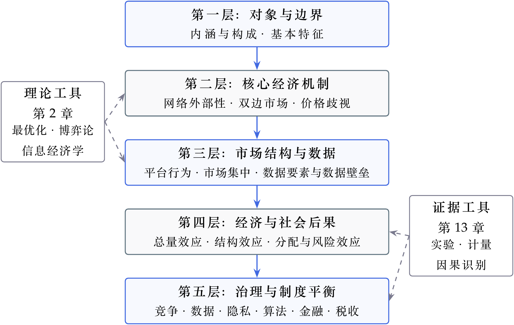
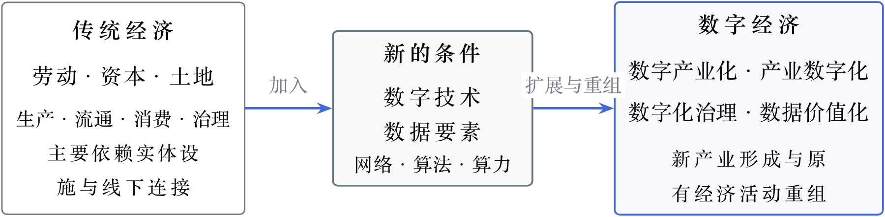
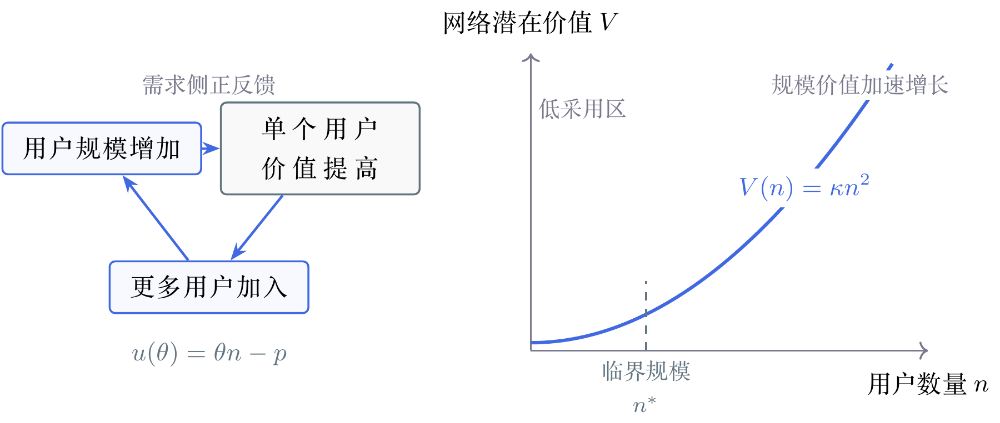
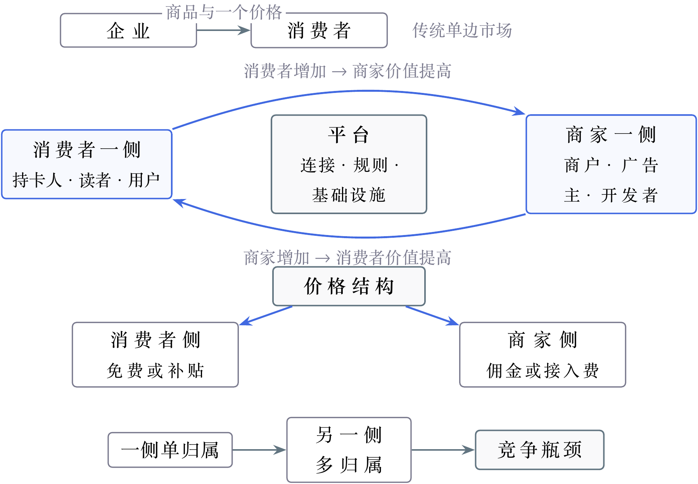
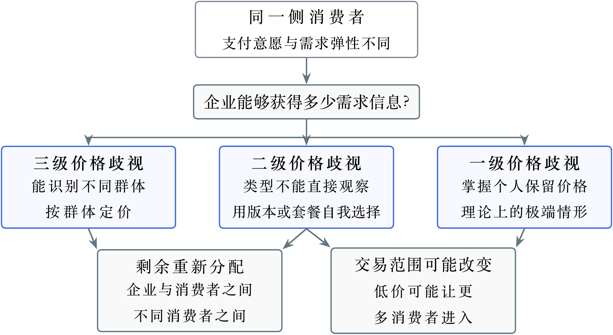
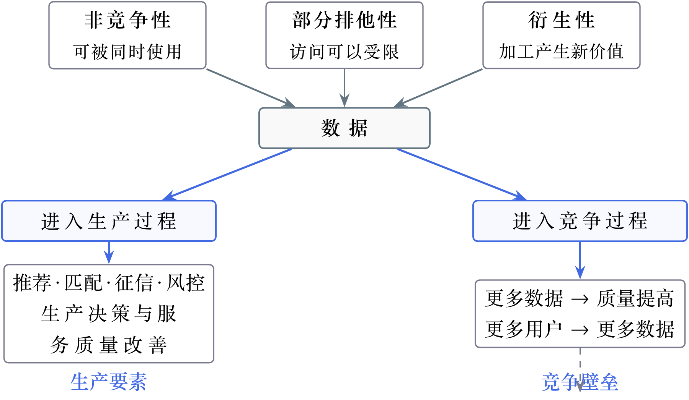
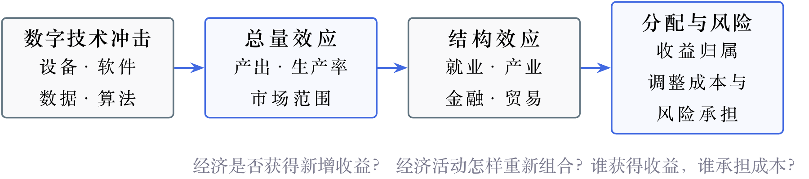

# 一、从一道题看数字经济

## 1.1 先看题目在问什么

这里选取一道数字经济专业课真题作为分析的起点。先看题目提出了什么问题，再试着用五层分析框架寻找原因、组织答案。

[**南京审计大学 2025 年 818 真题（35 分）**](https://gs.nau.edu.cn/_upload/article/files/95/d2/f85bcd2a41c894306fd4310764b0/98f83859-0a85-4156-948f-6ef610ba4ea4.pdf)

**题目背景摘要：**材料肯定平台经济的发展，同时列举 P2P 网贷爆雷、大数据杀熟等现象。

**设问原文：**

（1）我国平台经济发展中存在的突出问题。

（2）应如何监管我国平台经济发展？

两个设问是一前一后的关系：先说明平台出了什么问题，再说明怎样解决。要把两问接起来，还需要解释中间的一步：问题为什么会发生。

例如，“平台存在大数据杀熟，应加强监管”只点出了现象和目标。继续分析，就要回答：平台怎样判断不同用户愿意付多少钱？哪些消费者容易被多收费？什么办法能够约束这种行为？

**这道题可以沿着“问题表现 → 形成原因 → 谁受到影响 → 如何解决”的顺序展开。**

题目已经给了两个入口：大数据杀熟和 P2P 网贷爆雷。先解释这两个现象，再补充与它们有关的数据使用和市场竞争问题，答案就有了主线。

## 1.2 从题目中的现象寻找原因

### 1.2.1 大数据杀熟：平台怎样利用对用户的了解

购物、订酒店或叫车时，用户会留下搜索、浏览和购买记录。这些记录能够帮助平台推荐更合适的服务，也能帮助经营者判断用户的消费习惯，以及愿意支付的价格。

如果经营者发现某些用户不太比较价格、习惯使用同一个平台，就可能向他们报出更高的价格。[^1]当用户不知道其他人收到的报价，又觉得换平台麻烦时，这种做法就更容易持续。结果是，同样的服务，一部分消费者可能多付了钱。

判断具体价格差异时，需要比较服务内容、查询时间和优惠条件。例如，两间房的取消规则不同，价格差异就可能来自服务本身。题目中的“杀熟”则把关注点放在：经营者是否利用对用户的了解，实施不合理的区别收费。

解决问题的办法也由此明确：让价格和优惠规则更清楚，检查自动定价是否造成不合理的差别待遇，并让消费者有方便的投诉和处理渠道。

### 1.2.2 P2P 网贷爆雷：为什么到了还钱时却拿不出钱

P2P 网贷原本是通过网络把借款人和出借人联系起来。在[历史监管要求](https://www.cac.gov.cn/2016-08/24/c_1119448598.htm)下，这类平台负责提供信息和撮合借贷。如果平台把大家的钱集中起来，承诺到期还本付息，甚至把钱用于自己或关联公司的项目，风险就会发生变化。

其中一种风险来自时间上的错位：钱已经借出去，要较长时间才能收回，平台却承诺较早向出借人付款。[^2]一旦许多人同时要求拿回资金，平台手上的现金便可能不够。即使部分贷款将来能够收回，也解决不了眼前的付款困难。

另一类风险来自资金和信息管理。借款人的还款能力被夸大、资金被挪用、真实用途被隐瞒，都可能使出借人低估损失的可能性。因此，分析“爆雷”时，要查明钱去了哪里、什么时候能收回，以及平台作出了什么承诺。

相应的监管就应落在资金安全上：检查平台是否有资格开展相关业务，核对资金流向和付款安排，要求充分说明借款风险，并处理非法集资、挪用资金和欺诈等行为。

### 1.2.3 继续追问：平台为什么有能力这样做

前面两个现象还引出了更一般的问题：平台掌握的信息和规则，会怎样影响用户的选择？这一步能够把题干中的个别现象，扩展为对平台经济问题的分析。

一方面，平台能够掌握大量用户数据，用户却未必清楚这些数据被收集了多少、用在何处。如果企业从使用数据中获得收入，而信息泄露和错误判断的损失主要由用户承担，就需要明确数据收集、使用和保护的责任。

另一方面，商家往往希望进入消费者多的平台，消费者也更愿意使用商家多、选择丰富的平台。[^3]已有的规模优势因而可能继续扩大。如果商家过度依赖一个平台，或者用户很难把数据和使用记录转到其他平台，他们就更难选择其他服务。

平台的规模能够带来便利，也可能被用来限制选择。判断竞争问题，要看平台采取了什么行为：是否限制商家进入其他平台，是否阻碍其他企业接触用户，以及这些做法怎样损害竞争。

**到这里，五层框架已经进入了分析：看清平台在做什么，解释问题怎样发生，观察选择受到什么限制，判断谁承担损失，再提出解决办法。**

## 1.3 把分析整理成完整答案

前面的讨论可以按题目的两个设问整理。第一问把问题与原因放在一起，第二问逐项给出对应的解决办法。

### 1.3.1 示范答案：平台经济发展中的突出问题

平台通过连接商家与消费者、借款人与出借人，能够降低寻找交易对象的成本，提高服务效率。在发展过程中，数据使用、平台规则和资金管理也可能出现以下问题。

**第一，不合理的区别收费可能损害消费者利益。**平台利用用户的搜索、浏览和购买记录，判断其消费习惯和支付意愿。当用户难以比较报价、换平台的成本较高时，经营者可能对部分用户收取更高价格，使其为相同服务支付更多费用。判断这类行为，需要比较服务内容、交易时间和优惠条件，并检查定价是否利用了个人信息。

**第二，个人信息可能被过度收集或不当使用。**平台从数据使用中获得收入，用户却可能难以了解信息的去向和用途。过度收集、信息泄露和错误的自动化判断，会损害用户权益，也会削弱用户对平台的信任。

**第三，平台规则可能限制市场竞争。**消费者和商家相互吸引，能够使领先平台继续扩大。若商家依赖其用户来源，用户又难以转移数据和使用记录，其他企业就更难进入市场。平台进一步利用排他性规则限制商家或用户选择时，可能损害竞争。判断时应区分正常的规模优势与限制竞争的行为。

**第四，网贷平台违规经营可能造成资金损失。**部分平台偏离提供信息、撮合借贷的业务范围，集中管理资金、承诺付款，甚至挪用资金。若贷款尚未收回而付款期限已经到来，便可能出现现金不足；借款风险被隐瞒、资金被用于关联项目或存在欺诈时，出借人的损失还可能进一步扩大。

### 1.3.2 示范答案：如何监管平台经济发展

监管应针对问题的具体原因，保护用户权益、维护公平竞争和资金安全，同时保留平台提高交易效率的作用。

**第一，规范数据使用与自动定价。**明确个人信息的收集范围和使用目的，加强信息安全管理。对利用个人信息实施自动化决策的行为，落实[《个人信息保护法》](https://www.samr.gov.cn/wljys/gzzd/art/2023/art_3ef1e889c1e644d4b65b5f5c7f432386.html)第 24 条关于公平性和不合理差别待遇的要求，让价格规则、优惠条件和投诉渠道更加清楚。

**第二，约束限制竞争的行为。**结合用户是否容易换平台、商家是否有其他销售渠道、竞争者能否获得必要的数据和接触用户等情况，判断平台的市场力量。对限制商家选择、排斥竞争者等行为，依据具体事实和[适用规则](https://www.cac.gov.cn/2021-02/08/c_1614355697016097.htm)开展监管，兼顾正常经营和创新带来的收益。

**第三，按实际业务监管金融活动。**查明平台是在提供借贷信息，还是实际管理资金、承担付款承诺，并检查其业务资格。核对资金去向、贷款期限与付款安排，要求说明真实风险，对非法集资、挪用资金和欺诈等行为依法处理。

**第四，加强投诉处理与部门协作。**让消费者、商家和出借人能够及时反映问题。对同时涉及交易、数据和金融的平台业务，有关部门应加强信息共享，及时发现和处理风险，并根据实际效果调整监管措施。

**完整答案中的每一项对策，都能回到前面已经说明的问题和原因。**

这道题展示了五层框架的一次应用。接下来的“理解数字经济的五层框架”将说明各个层次包含哪些知识，以及这些知识之间怎样相互连接。

# 二、理解数字经济的五层框架

数字经济的内容可以放入五个相互衔接的层次：先界定研究对象，再寻找现象背后的经济机制；机制在市场中持续作用，会进一步形成企业行为和市场结构，并产生总量、结构、分配与风险效应，最后进入治理与制度平衡。

第 2 章的理论工具和第 13 章的证据工具放在框架两侧。第 2 章为后续模型推导提供数学、博弈论和信息经济学工具，第 13 章为经验分析和因果识别提供计量方法；它们为五个层次的分析提供方法支持。

## 2.1 五层框架：对象—机制—结构—结果—治理

*图 1：数字经济五层分析框架*

图 1 中的箭头表示分析从对象逐步扩展到结果与治理。根据题目的具体设问，可以从相应层次调用知识，并借助理论工具完成模型推导、借助证据工具开展经验检验。

## 2.2 第一层：对象与边界——什么才算数字经济

一家软件企业属于数字经济，这一点没有太大争议。但一家制造企业把生产线接入工业互联网，一家商店通过平台销售商品，一家银行利用数据开展征信，一个政府部门用数据辅助公共治理，它们算不算数字经济？

回答这些问题，不能只看某项活动是否"搬到了线上"，也不能把数字经济简单等同于互联网企业。数字经济既包括数字技术催生的新产业，也包括数字技术和数据要素对传统生产、交易与治理活动的改造。

### 2.2.1 从传统经济到数字经济，什么发生了变化？

传统经济主要围绕劳动、资本、土地等要素组织生产，生产、流通、消费和治理大多依赖实体设施与线下连接。数字技术和数据要素进入这些活动，使原有经济体系的活动范围与组织方式发生变化。

*图 2：从传统经济到数字经济*

数字技术和数据进入经济活动后，一方面催生了软件、通信、云计算等新的数字产业；另一方面进入制造、商业、金融和公共治理，改变原有的生产与治理方式。

这些变化可以从数字产业化、产业数字化、数字化治理和数据价值化四个方面理解。数字产业化对应新产业的形成，产业数字化对应传统产业的改造，数字化治理将数字技术用于公共治理和市场治理，数据价值化则使生产经营中形成的数据经过采集、加工和权利配置，成为可以开发利用的资源。四者共同构成数字经济的基本范围。

### 2.2.2 为什么数字市场会呈现不同规律？

数字产品与传统产品之间的重要差别，主要体现在成本结构和报酬性质上。

**第一，复制与分发的边际成本趋近于零。**软件、数据和数字内容通常需要较高的前期投入，但产品一旦形成，新增一次复制或分发的成本很低。如果仍然按照边际成本定价，企业便难以收回前期投入，因此需要借助订阅、广告补贴、版本区分等方式实现收入。零边际成本由此改变了传统市场的定价逻辑。

**第二，边际收益递增。**这种递增来自两个方向：在需求侧，网络外部性使用户越多，产品对每个用户的价值越高；在供给侧，数据具有非竞争性，同一份数据可以同时进入多个生产过程。两种力量叠加，使数字市场形成"越大越强"的正反馈，并可能推动市场走向集中。

零边际成本改变企业的定价与变现方式，边际收益递增则放大网络规模与数据积累的价值。[^4]接下来，需要进一步解释这些变化通过什么经济机制发挥作用。

## 2.3 第二层：核心经济机制——理解数字市场的三组工具

为什么一个产品的用户越多，它反而越有价值？为什么平台可以长期补贴消费者，却向商家收取佣金？为什么同一种数字服务，会向不同消费者收取不同价格？

这三个看似反常的现象，分别对应教材第 3—5 章反复使用的三组核心工具。表 1 概括了每组工具需要解释的问题及其在分析中的作用。

**表 1：数字市场的三组核心工具**

| **需要解释的问题** | **核心工具** | **工具在分析中的作用** |
| --- | --- | --- |
| 为什么规模本身能够创造价值 | 网络外部性 | 解释用户规模怎样进入产品价值，并形成正反馈 |
| 为什么平台会补贴消费者，却向商家收费 | 双边市场 | 解释交叉网络外部性、价格结构与平台补贴 |
| 为什么同一种服务会有不同价格 | 价格歧视 | 解释需求差异如何进入定价及其福利后果 |

### 2.3.1 网络外部性：规模为什么能够创造价值

传统商品的价值主要取决于商品自身的质量和价格，网络产品的价值还会受到用户规模影响。网络外部性是指：一种产品或服务对某个用户的价值，会随着使用同一产品或兼容产品的其他用户数量变化而变化。在第 3 章的基本模型中，这种关系被写入用户效用：

$$
u(\theta)=\theta n-p.
$$

其中，$n$ 表示预期或实际用户规模，$\theta$ 表示用户对网络价值的重视程度，$p$ 表示接入价格。用户规模直接进入用户效用，成为产品价值的一部分，并进一步影响用户的加入决策。

网络外部性不仅意味着单个用户获得的价值会随用户规模增加，也意味着整个网络的潜在价值会随用户数量扩大。梅特卡夫定律将这种关系表示为：

$$
V(n)=\kappa n^2.
$$

其中，$n$ 表示用户数量，$\kappa$ 表示每条潜在连接的平均价值。用户数量增加一倍，整个网络的潜在价值大约增加到原来的四倍。[^5]这说明，网络规模的扩大不只是增加了用户数量，还会更快地放大整个网络可能创造的价值。潜在网络价值衡量网络可能创造的价值，平台实际收入与利润还取决于定价、成本和变现方式。

*图 3：网络外部性：规模为什么能够创造价值*

正反馈并不意味着网络一定会自动增长。规模低于临界点时，用户获得的价值不足，网络可能继续收缩；越过临界点以后，用户规模与产品价值相互强化，网络才可能进入高采用均衡。因此，平台早期的补贴、预发布和兼容策略，都是为了影响用户预期并推动网络越过这一门槛。

**网络外部性解释的是：为什么用户规模不仅是增长的结果，本身也是价值的来源。**

### 2.3.2 双边市场：平台为什么会补贴消费者，却向商家收费？

持卡人购买商品时仍然需要支付商品价款，但通常不需要为刷卡本身向银行卡网络付费，还可能获得积分或返现；商家每完成一笔银行卡交易，却要支付刷卡手续费。同一个支付平台为什么会让消费者一侧免费甚至获得补贴，却向商家一侧收费？

在传统的单边市场中，企业生产或采购商品，再将商品出售给消费者。企业主要面对一类需求者，通常只需要决定一个价格。平台则不同：它提供连接、规则和交易基础设施，让两类用户在平台上互动。一侧用户增加会提高另一侧参与平台的价值，这种跨越平台两侧的影响称为**交叉网络外部性**。

交叉网络外部性带来两个直接后果。第一个出现在平台启动阶段：消费者会因为商家太少而不愿加入，商家又会因为消费者太少而不愿进入，由此形成鸡生蛋问题。平台要打破这种相互等待，就需要先创造足够的初始规模，常见做法是对一侧免费或给予补贴，用这一侧的参与带动另一侧进入。

第二个后果体现在平台定价上。平台对一侧降价，不仅会扩大该侧的参与规模，还会通过交叉网络外部性提高另一侧加入平台的价值。因此，平台定价不能只考虑"总共收多少"，还要决定"向谁收费、补贴谁"。平台向两侧收取的费用之和称为**价格总水平**，这笔费用在两侧之间如何分配称为**价格结构**。例如，每笔交易合计收费 10 元，全部由商家承担，与全部由消费者承担，价格总水平相同，价格结构却完全不同。如果总收费不变，仅仅改变两侧的价格分配，就会改变参与规模和交易量，这种现象称为**价格结构非中性**。这也是双边市场的判定标准。

*图 4：双边市场：平台为什么会补贴消费者，却向商家收费？*

当平台对一侧免费或给予补贴、向另一侧收取较高费用时，就形成了双边市场常见的**倾斜式定价**。这种定价不只是对鸡生蛋问题的临时应对，也可能成为平台利用价格结构协调两侧参与的长期安排。[^6]具体补贴哪一侧，并不由"买方"或"卖方"的身份决定，而取决于两侧的价格弹性，以及一侧用户增加能够为另一侧创造多少价值。

以上讨论关注一个平台如何协调两侧。市场中一旦出现多个竞争平台，问题还要进一步考虑用户怎样选择平台。用户只加入一个平台，称为**单归属**；同时加入多个平台，称为**多归属**。用户是否多归属，取决于第二个平台带来的增量价值能否覆盖额外的接入和使用成本。

当一侧用户单归属、另一侧用户多归属时，就可能形成**竞争瓶颈**。平台会争夺单归属用户；一旦获得这些用户，每个平台都掌握了通向自己用户的独占入口。多归属一侧为了覆盖全部单归属用户，只能分别接入每一个平台。经典的报纸市场中，读者通常只读一份报纸，广告主却需要在多份报纸上投放，报纸因而可以低价吸引读者，再向广告主收费。归属结构由此进一步影响平台究竟补贴哪一侧、向哪一侧收费。

这里还需要区分两种看似相近的收费方式。双边市场的价格结构讨论平台如何在**不同侧之间**分配价格；下一节的价格歧视则讨论企业如何在**同一侧内部**针对不同消费者设计价格。

**双边市场解释的是：平台为什么会补贴消费者、向商家收费，以及这种价格结构如何协调两侧参与。**

### 2.3.3 价格歧视：为什么同一种服务会有不同价格？

双边市场讨论的是价格怎样在平台两侧之间分配。确定向哪一侧收费以后，企业还要继续决定：同一侧的所有消费者，是不是都收取相同价格？同一厂商对同一产品向不同消费者收取不同价格的做法，称为**价格歧视**。

消费者对同一种产品的支付意愿和需求弹性不同。统一定价虽然简单，却可能同时留下两个问题：愿意支付更高价格的消费者保留了较多剩余，支付意愿较低的消费者又可能被统一价格挡在市场之外。企业如果能够识别这些差异，就有动力针对不同消费者设计不同价格。

企业掌握的信息不同，差异化定价的方式也不同。能够识别不同群体时，可以按群体定价，这属于**三级价格歧视**；无法直接观察消费者类型时，可以设计数量、版本或套餐菜单，让消费者通过选择主动暴露类型，这属于**二级价格歧视**；如果企业能够掌握每个消费者的保留价格并分别定价，就接近**一级价格歧视**，这是理论上的极端情形。

*图 5：价格歧视：为什么同一种服务会有不同价格？*

不过，行为数据提高的只是平台识别需求差异的精度，并不意味着平台已经准确掌握每个人的保留价格。[^7]因此，现实中的行为定价和个性化定价不能直接等同于理论上的一级价格歧视。

**价格歧视解释的是：企业在确定向哪一侧收费之后，怎样进一步利用同一侧内部的需求差异设计价格。**

## 2.4 第三层：市场结构与数据——优势怎样累积为市场结构

第二层从单个机制出发，解释数字市场中的价值、交易与定价。第三层把视线拉长到整个竞争过程，观察网络效应、规模经济和数据反馈持续作用以后，领先优势怎样积累并沉淀为市场结构。

这一过程可以沿着一条动态路径展开：

**优势形成 → 数据反馈强化 → 优势沉淀为市场集中 → 辨别效率贡献与竞争壁垒**

### 2.4.1 优势的形成：网络效应与规模经济

领先优势首先来自需求侧和供给侧两种力量。需求侧的网络效应使用户规模成为产品价值的一部分：使用者越多，产品越有吸引力，已经拥有较多用户的平台因而更容易继续吸引用户。供给侧的规模经济则来自数字产品的成本结构：研发、服务器、内容和系统建设在初期需要较高的固定投入，复制与分发的边际成本却很低；用户越多，固定成本就能由更多人分摊，平均成本随之下降。

两种力量叠加后，领先平台可能同时拥有更高的用户价值和更低的单位成本。不过，初期领先并不必然转化为长期支配。要理解优势为什么会持续扩大，还要看平台能否把用户规模转化为新的服务质量优势。

### 2.4.2 优势的强化：数据反馈循环

用户使用平台会产生搜索、点击、交易和评价数据，平台再利用这些数据改善推荐、匹配、征信与风控。服务质量提高以后，平台能够吸引并留住更多用户，而新增用户又会带来更多数据。这一过程可以概括为：

**用户规模增加 → 数据存量增加 → 服务质量提高 → 用户规模继续增加**

数据反馈把已有的规模优势转化为下一轮竞争优势，但这种强化并不是无限的。第 6 章的数据反馈模型同时考虑了数据价值的边际递减：当数据已经较为丰富时，新增数据对服务质量的改善可能越来越小。[^8]真正容易形成壁垒的情形，是领先平台掌握的数据难以获取、迁移或互操作，而进入者又缺少改善服务所需的初始数据。后来者由此可能陷入"无数据则无质量、无质量则无用户、无用户则无数据"的循环。

### 2.4.3 优势的沉淀：从领先地位到市场集中

当网络效应、规模经济和数据反馈相互强化，并且用户迁移、数据获取或兼容接入存在障碍时，短期领先可能不断累积，逐渐形成"赢家通吃"或"赢家通吃大部分"的市场格局。

但市场集中只是竞争过程形成的一种结构，并不自动意味着垄断。判断平台是否具有市场支配地位，还要结合市场边界、进入壁垒和潜在竞争；[^9]即使具有支配地位，也只有在企业利用这种力量排除、限制竞争时，才进入滥用行为的判断。

**市场集中不等于市场支配地位，市场支配地位也不等于滥用。**

### 2.4.4 数据的双重角色：生产要素与竞争壁垒

回到这条演化链，数据实际上出现了两次：它既进入企业的生产过程，改善推荐、匹配、征信、风控和生产决策；也进入企业之间的竞争过程，强化领先者的质量优势。这两种作用来自数据本身的经济属性。[^10]数据具有**非竞争性**，同一份数据可以被多个主体同时使用；具有**部分排他性**，企业可以限制他人访问，但数据又容易复制和扩散；还具有**衍生性**，聚合、加工和关联分析能够继续产生新的数据与价值。

*图 6：数据的双重角色：生产要素与竞争壁垒*

## 2.5 第四层：经济与社会后果——从总量变化到收益与成本的分配

前三层关注数字市场怎样运行，第四层则把视线从企业和市场扩展到整个经济社会。图 7 从同一项数字技术冲击出发，展示它怎样由企业内部扩散到经济总量、内部结构以及不同主体的收益与成本。

*图 7：数字化影响如何从总量变化传导到分配结果*

总量变化说明整个经济是否获得了新增收益，结构变化进一步揭示这些收益通过哪些行业、任务和交易方式实现，分配与风险则说明谁最终得到收益、谁承担调整成本。数字化可能在提高总体效率的同时，使部分劳动者、企业或地区面临更大的转型压力。

### 2.5.1 总量效应：产出、效率与市场范围

企业购买更多设备和软件，产出可能会增加，但这并不等于生产效率已经提高。真正的效率改善，是用同样的人力和资本生产出更多产品，或者用更少的资源完成原来的工作。数字技术只有进一步改变生产流程、组织方式和资源配置，才会带来这种变化。

按照通常的理解，企业大量使用计算机、软件和其他数字技术以后，生产效率应该随之提高。但现实中曾经出现一种反差：数字技术投资快速增长，计算机已经广泛进入生产和生活，宏观生产率统计却长期没有明显改善。这种"技术随处可见，生产率数据中却看不出来"的现象，就是**索洛悖论**。

索洛悖论提示，技术投入与生产率提高可能存在差距。这种差距可以从三个方面理解：一是**测度问题**，统计未能充分反映产品质量提升、免费数字服务的价值，以及软件和数据等无形投入；二是**时滞效应**，企业需要时间调整流程、培训人员并改变组织方式，技术投入的效果才会逐步显现；三是**分配效应**，技术收益在企业之间分布不均，少数领先企业的效率改善未必能带动整体生产率同步提高。[^11]技术投入需要与流程、人员和组织调整相配合，才能转化为生产率改善：

**数字投入 → 流程、人员与组织调整 → 技术推广应用 → 生产率提高**

### 2.5.2 结构效应：就业、产业、金融与贸易的重组

总量指标告诉我们经济是否增长，却不能说明增长发生在什么地方。即使总产出和就业数量没有明显下降，劳动者承担的任务、企业组织生产的方式以及金融和贸易的实现渠道也可能已经发生变化。因此，第二步要把分析从"增加了多少"深入到"经济活动被怎样重新组合"。

自动化通常先替代职业中的部分任务。重复、规则清楚的任务更容易交给机器，需要沟通、判断和创造的任务则可能因为技术辅助而变得更重要。旧任务减少的同时，成本下降、需求扩大和新产品出现又可能创造新的工作，因此"机器替代了一些任务"不能直接推出"就业总量一定下降"。

企业的组织方式也会改变。寻找供应商、在线签约和跨企业协作变得更容易以后，一些原来在企业内部完成的工作可以转向外包和平台；管理系统和实时数据又可能降低大企业内部的协调难度。与此同时，数字化往往需要先承担系统建设、数据治理和人员培训等投入，业务规模越大，越容易分摊这些成本，中小企业因而可能面对更高的转型门槛。

金融和贸易的变化更加直观。金融服务不再完全依赖物理网点，过去服务成本过高的小微企业和个人可以通过数字渠道获得支付、信贷和保险；软件、咨询和内容等服务也可以直接在线交付，跨境交易不再都以实物运输为前提。[^12]数字化改变的因此不只是业务数量，还有服务对象、交付渠道和市场边界。

### 2.5.3 分配与风险效应：收益归属与成本承担

就业、产业和市场结构的变化，会进一步改变收入和机会在不同群体之间的分配。数字化带来的收益并不会平均落到每个人身上。掌握新技术的劳动者可能获得更多机会，重复性、程序化的工作更容易受到冲击；在能够低成本复制和传播的数字市场中，原本很小的能力或资源差距也可能被迅速放大，使少数企业或个人获得大部分收益。

有些群体甚至没有真正进入数字红利的分配过程。数字鸿沟不只是"有没有网络"：有人无法接入网络和设备，有人接入以后不会有效使用，也有人使用了数字技术，却没有把它转化为收入、教育和生活机会。这三层差距分别称为**接入沟、使用沟和结果沟**。因此，接入率提高并不代表不同群体已经获得了相同的发展机会。

风险同样存在分配问题。[^13]平台通过数据和算法改善服务并获得收入，信息泄露和错误判断的成本却可能由用户承担；数字金融让资金流动得更快，出现问题时风险也可能更快扩散；企业通过自动化降低成本，被替代的劳动者则需要承担转岗、培训和收入波动。分析风险不能只列出"可能发生什么"，还要看获得收益的人是否承担了相应成本。

## 2.6 第五层：治理与制度平衡——从识别问题到选择制度

第四层已经说明，数字化带来的收益和成本可能落到不同主体身上。第五层接着判断：这种分离能否由市场自行纠正，是否需要制度介入，以及采用什么方式才能在控制问题的同时保留价值创造。

**识别问题 → 匹配工具 → 比较治理收益与成本 → 根据结果调整**

### 2.6.1 治理的起点：市场无法自行解决的成本

数字技术存在风险，并不自动意味着需要政府介入。真正需要治理的情形，是获得收益的主体没有承担相应成本，而竞争、交易或既有规则又无法使其主动改正。

这种情况会以不同形式出现。平台控制了商家接触消费者的重要入口，其他企业可能难以参与竞争；用户不知道自己的数据怎样被使用，也很难发现算法什么时候发生错误；数字金融机构扩大业务，出现问题时风险却可能扩散到更多机构和用户；企业通过自动化降低成本，被替代劳动者则集中承担转岗和收入波动。数字业务跨越国界以后，单一国家的税收和数据规则还可能无法覆盖全部影响。

这些现象虽然不同，背后都有同一个问题：

**治理需要关注收益、风险与成本在不同主体之间的分配，并判断市场能否自行纠正其中的问题。**

### 2.6.2 工具的匹配：不同问题需要不同制度

制度工具各有自己的处理对象。把所有问题都笼统归结为"加强平台监管"，容易出现工具与问题不匹配。表 2 将不同问题与相应的制度回应方向对应起来。

**表 2：不同问题与制度回应方向**

| **出现的问题** | **制度回应方向** |
| --- | --- |
| 平台排除竞争、控制关键入口 | 竞争政策与反垄断 |
| 数据被过度收集或滥用，算法决策不透明 | 数据、隐私与算法治理 |
| 金融风险可能向整个体系扩散 | 持牌经营、审慎监管与风险隔离 |
| 劳动者和数字弱势群体承担转型成本 | 职业培训、社会保障与数字包容 |
| 数字利润和数据流动超出单一国家边界 | 数字税与跨境协调 |

反垄断不能直接解决隐私侵害，用户点击"同意"也不能消除金融风险，职业培训更不能纠正平台排他行为。分析时要先说清楚问题发生在哪里，再选择能够处理这一问题的制度工具。

### 2.6.3 制度的边界：纠正风险，也保留价值创造

制度介入能够纠正问题，也会改变企业成本和创新动力。规则过松，竞争损害、隐私泄露和金融风险可能继续累积；规则过严，中小企业的合规成本可能上升，数据流通和创新试错空间也可能被压缩。因此，治理并不是限制越多越好。

平台规模可能来自真实的效率优势，不能只因企业规模大就处罚，而要看它是否利用关键入口排除竞争；[^14]数据使用能够创造价值，也不能简单选择"一律开放"或"一律禁止"，而要根据数据类型、使用目的和风险大小设置不同要求；数字金融能够扩大服务覆盖，但只要承担了金融功能，就不能脱离相应的风险约束。

每一项治理方案最终都要回到两个判断：

**制度是否针对真正的问题？解决问题带来的收益，是否超过合规成本和创新损失？**

[^1]: 完整版第 5 章：价格歧视与消费者剩余。第 12 章：个人信息与算法治理。

[^2]: 完整版第 10 章：期限错配与挤兑。钱收回来的时间晚于付出去的时间，就是期限错配。

[^3]: 完整版第 4 章：平台两侧用户怎样相互吸引。第 6—7 章：市场竞争与数据壁垒。

[^4]: 完整版第 1 章：定义口径、三大定律、概念谱系与测度方法。

[^5]: 完整版第 1 章：潜在连接数、平方关系及其修正形式。

[^6]: 完整版第 4 章：价格结构公式、补贴条件、多归属与竞争瓶颈模型。

[^7]: 完整版第 5 章：三级弹性定价、二级自选择、一级剩余分配与行为定价。

[^8]: 完整版第 6 章：动态反馈、边际递减与数据冷启动模型。

[^9]: 完整版第 6 章：相关市场、HHI、勒纳指数与支配地位认定。

[^10]: 完整版第 7 章：数据确权、定价、资产入表与壁垒识别。

[^11]: 索洛模型基础见科晟智慧公开课；增长核算、索洛悖论和数据增长模型见完整版第 8 章。

[^12]: 完整版第 9--11 章：任务模型、企业边界、数字普惠金融与数字贸易。

[^13]: 完整版第 9、10、12 章：就业极化、数字鸿沟、金融风险与隐私外部性。

[^14]: 完整版第 6、10、12 章：事前监管、持牌经营、隐私、算法与数字税治理。
